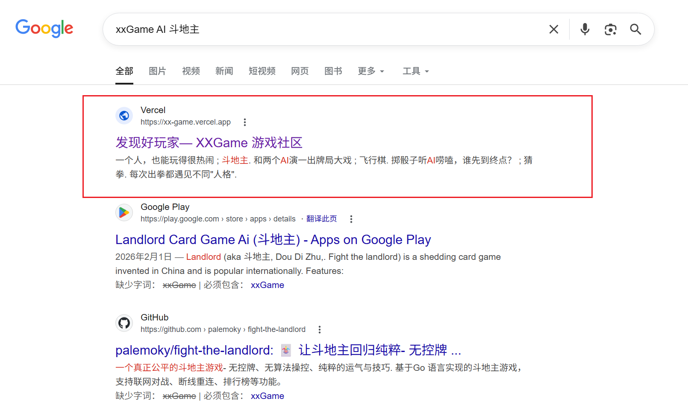

# XXGame — 游戏玩家社区

AI 游戏社区中心，为玩家提供内容发布、互动交流、游戏讨论的一站式平台。


## AI 辅助开发

本项目使用 Claude Code CLI 进行 AI 辅助开发，配置如下：

- **后端大模型**: DeepSeek V4 Pro/Flash
- **MCP 服务**: Figma (Framelink) — 从 Figma 设计稿提取节点数据和 SVG 资源
- **Agent 类型**: code-review（自动化代码审查）、Explore（快速代码搜索）、Plan（架构方案设计）
- **Skills**: brainstorming（功能设计）、writing-plans（实现计划）、subagent-driven-development（并行子任务执行）、verification-before-completion（完成前验证）
- **Plugins**: superpowers（工作流增强）、commit-commands（快捷提交）、github（PR/Issue 管理）、claude-md-management（CLAUDE.md 维护）、karpathy-guidelines（编码规范）


## 技术栈

- **框架**: Next.js 16 (App Router + Turbopack) + React 19 + TypeScript 5.9
- **样式**: TailwindCSS v4 + tw-animate-css
- **UI 组件**: shadcn/ui（基于 Radix UI）+ lucide-react + Sonner (toast)
- **状态管理**: Zustand（用户认证状态）
- **数据库**: PostgreSQL（Supabase）
- **ORM**: Prisma 7 + @prisma/adapter-pg
- **文件存储**: Supabase Storage
- **短信**: 阿里云 SMS（主） + UniSMS（备用）
- **包管理**: pnpm


## 当前状态

- [x] 手机号 + 验证码登录（阿里云短信）
- [x] 密码登录（bcrypt）
- [x] 修改密码（已设置密码需校验原密码）
- [x] JWT 鉴权（7 天过期，localStorage 持久化）
- [x] 帖子列表（游标分页 + 骨架屏加载）
- [x] 帖子详情（图片轮播、统计）
- [x] 发布帖子（表单 + 封面图片上传）
- [x] 图片上传（Supabase Storage，SHA-256 去重）
- [x] 首页（游戏卡片：斗地主、飞行棋、猜拳）
- [ ] 评论/点赞 UI
- [ ] 后台管理（审核、标签管理）

## 项目展示

[项目设计图 — XXGame-V1 (Figma)](https://www.figma.com/design/z8ontv0eTqv8M1Yk6fKLUw/XXGame-V1?node-id=0-1&t=ElhrCHFEr7zH5mH0-1)

SEO 效果展示：



## 项目结构

```
src/
├── app/                              # Next.js App Router
│   ├── globals.css                   # TailwindCSS v4 入口
│   ├── layout.tsx                    # 根布局（NavBar + SEO + Toast）
│   ├── page.tsx                      # 首页（Slogan + 游戏卡片）
│   ├── icon.png                      # Favicon
│   ├── robots.ts / sitemap.ts        # SEO
│   ├── web/interactions/
│   │   ├── page.tsx                  # 互动列表（游标分页 + 骨架屏）
│   │   ├── new/page.tsx              # 发布互动帖
│   │   └── [id]/page.tsx             # 帖子详情
│   ├── api/
│   │   ├── posts/
│   │   │   ├── route.ts              # GET 游标分页 / POST 创建帖子
│   │   │   └── [id]/route.ts         # GET 帖子详情
│   │   ├── upload/route.ts           # POST 图片上传（Supabase Storage）
│   │   ├── sms/send-code/route.ts    # POST 发送短信验证码
│   │   └── auth/
│   │       ├── verify-code/route.ts  # POST 验证码登录/注册
│   │       ├── password-login/route.ts # POST 密码登录
│   │       └── password/route.ts     # PUT 修改密码
├── components/
│   ├── nav-bar.tsx                   # 顶部导航（sticky，用户下拉菜单）
│   ├── login-dialog.tsx              # 登录弹窗（验证码/密码模式切换）
│   ├── login-dialog/
│   │   ├── phone-input.tsx           # 手机号输入
│   │   ├── code-input.tsx            # 验证码输入 + 倒计时
│   │   └── password-input.tsx        # 密码输入
│   ├── change-password-dialog.tsx    # 修改密码弹窗
│   ├── cover-image-upload.tsx        # 帖子封面上传
│   ├── file-upload-demo.tsx          # 文件上传演示
│   ├── icons.tsx                     # SVG 图标组件库
│   ├── toast-provider.tsx            # Sonner toast 包裹层
│   └── ui/                           # shadcn/ui 组件
│       ├── button.tsx / dialog.tsx / card.tsx / avatar.tsx
│       └── input.tsx / textarea.tsx / skeleton.tsx / file-upload.tsx
├── stores/
│   └── user-store.ts                 # Zustand 用户认证状态
├── hooks/
│   ├── use-as-ref.ts
│   ├── use-lazy-ref.ts
│   └── use-isomorphic-layout-effect.ts
├── lib/
│   ├── prisma.ts                     # Prisma Client 单例
│   ├── supabase.ts                   # Supabase Client
│   ├── jwt.ts                        # JWT 签名/验证（jose，HS256）
│   ├── auth.ts                       # 服务端 auth 工具（从请求头解析用户）
│   ├── api-client.ts                 # 通用 fetch 封装（自动 Bearer token）
│   ├── sms.ts                        # 短信发送器路由层
│   ├── sms-aliyun.ts                 # 阿里云 SendSmsVerifyCode
│   ├── sms-unisms.ts                 # UniSMS 备用
│   ├── file-hash.ts                  # SHA-256 文件哈希（上传去重）
│   └── utils.ts                      # cn() = twMerge(clsx(...))
└── types/
    └── api.ts                        # API 请求/响应类型
```

## 路由

| 路径 | 类型 | 说明 |
|------|------|------|
| `/` | Server | 首页 |
| `/web/interactions` | Client | 互动列表（游标分页） |
| `/web/interactions/new` | Client | 发布互动帖 |
| `/web/interactions/[id]` | Client | 帖子详情 + 评论占位 |
| `GET /api/posts?cursor=&limit=` | API | 游标分页帖子列表 |
| `POST /api/posts` | API | 创建帖子（需登录） |
| `GET /api/posts/[id]` | API | 帖子详情 |
| `POST /api/upload` | API | 上传图片至 Supabase Storage（需登录） |
| `POST /api/sms/send-code` | API | 发送短信验证码（60s 冷却） |
| `POST /api/auth/verify-code` | API | 验证码登录/注册 |
| `POST /api/auth/password-login` | API | 密码登录 |
| `PUT /api/auth/password` | API | 修改密码（需登录） |

## 鉴权架构

- **前台用户**: 手机号 + 短信验证码 或 密码登录，JWT 鉴权
  - 自建体系，无第三方依赖（Auth0/Clerk）
  - 用户信息 + token 存入 localStorage，Zustand 管理全局状态
  - `api()` 封装自动附带 Bearer token
- **后台管理**: email + bcrypt 密码登录（独立体系，待开发）

## 数据库

11 张表，PostgreSQL + Prisma 7：

```
users ──1:N──→ posts / comments / likes / verification_codes
admins (独立) ──1:N──→ audit_logs
workspaces ──1:N──→ posts
posts ──M:N──→ tags (via post_tags)
posts ──1:N──→ post_images / audit_logs
comments ──自引用──→ comments (二级嵌套回复)
likes ──多态──→ posts / comments (via target_type + target_id)
```

可视化管理：`pnpm dlx prisma studio`

## 开发约定

- **React 按需引用**: `import { useState } from "react"`，禁止 `import * as React`
- **图标管理**: 页面 inline SVG 必须提取到 `src/components/icons.tsx`，`stroke="currentColor"` + `className`
- **API 类型共享**: 接口完成后将 Request/Response interface 添加到 `src/types/api.ts`
- **Server Component 优先**: 默认用 server component，需要交互时再 `"use client"`
- **Prisma 直查**: Server Component 直接查询，API Route 仅用于需客户端调用的场景
- **包管理**: 统一使用 pnpm，禁止 npm / yarn；CLI 命令使用 `pnpm dlx`
- **路径别名**: 使用 `@/` 指向 `src/`
